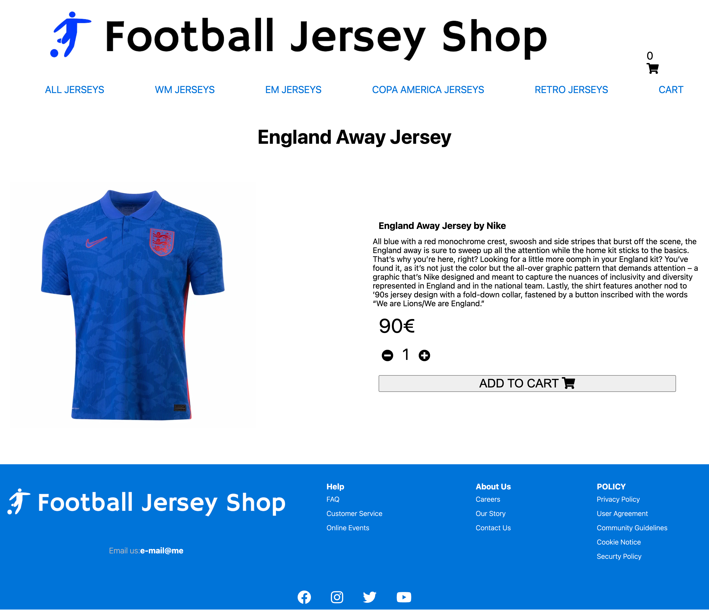

# E-commerce store - Football Jersey Shop

## Description

Football Jersey Shop is not a real company and no purchases can be made.
This is an E-commerce project for my web development course from https://upleveled.io/.

Visit my deployed Website here:

For good user experience please choose a min-width of 700px.

For the best user experience please choose a min-width of 1000px.

## Functionalities

- A landing page
- A products page where all the products are listed.
- A page for each single product with the ability to change the amount.
- A shopping cart page with a list of all products. The ability to change the amount, delete one product or delete every product. It shows the total price and the total amount of the products in the shopping cart.
- A checkout page which shows the items from the shopping cart, shipping and payment information
- A thank you page after a checkout.
- The header will show a shopping cart with the current number of items on all pages, it also links to the shopping cart.

## Technologies

- Next.js
- React
- Postgres
- Emotion
- Jest unit tests
- Cypress E2E tests
- Typescript

## Setup instructions

- Clone the repository with `git clone <repo>`
- Setup the database by downloading and installing PostgreSQL
- Create a user and a database
- Create a new file `.env`
- Copy the environment variables from `.env-example` into `.env`
- Replace the placeholders xxxxx with your username, password and name of database
- Install dotenv-cli with `yarn add dotenv-cli`
- Run `yarn install` in your command line
- Run the migrations with `yarn migrate up`
- Start the server by running `yarn dev`

## Deploy on Heroku

- Sign up at Heroku: [signup.heroku.com](signup.heroku.com)
- Create a new App
- Choose a name and select the "Europe" Region
- Click "Connect to GitHub"
- Search for your repository and click on "Connect". Click on "Enable Automatic Deploys"
- Go to the Overview tab and click "Configure Add-On"
- Search for "Postgres" and select "Heroku Postgres"
- Trigger a deploy by pushing your repo to GitHub

## Screenshots

### Landing Page

### Products Page

### Single Products Page

### Shopping Cart Page

### Checkout Page

